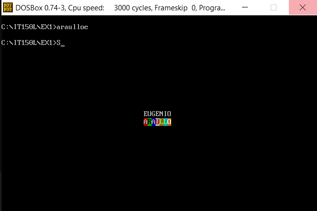

# EX1 - Name with colors
***
The objective is to output the student name with a flashing white foreground in the middle of the screen with different colors as the background.

Here's a preview of the output:

