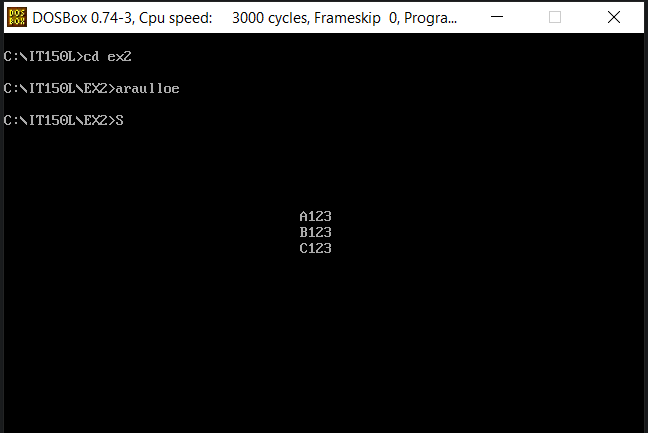

# EX2 - Name with colors
***
The objective is to use loops in assembly language to output the following text in the middle of the screen:<br/>
```
A123
B123
C123
```

Here's a preview of the output:<br/>

