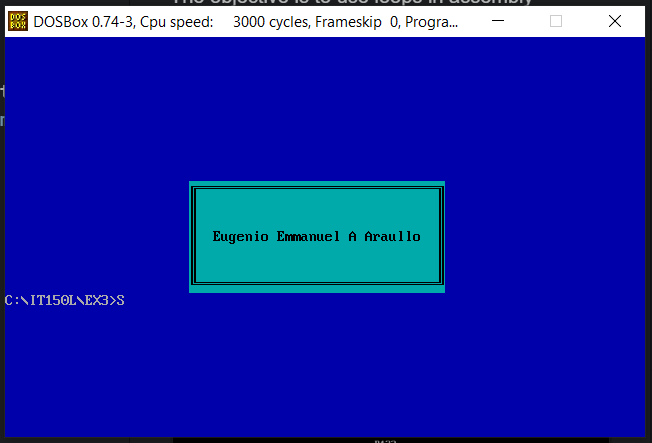

# EX3 - Strings and functions
***
The objective is to effectively employ the use of stored strings in Assembly and be able to output it in an easier way through the assembly equivalent of functions. 

Here's a preview of the output: 

