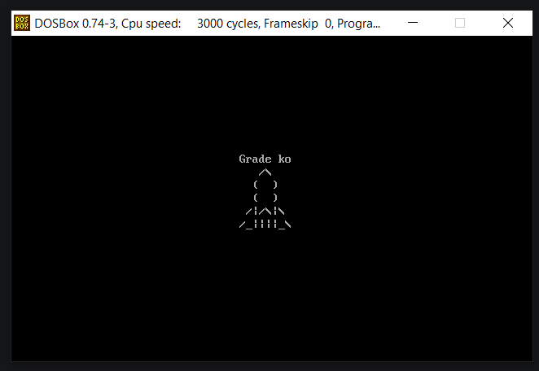

# EX4 - Make animated stuff in Assembly
***
Using procedures, akin to functions, the objective is to make an animation in assembly.

Here's a preview of the output: (irl the rocket moves upwards) 

