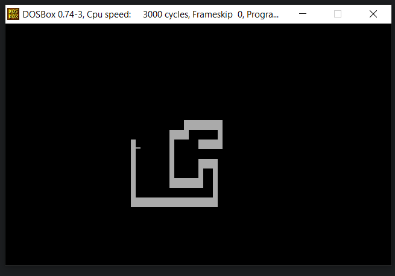

# EX5 - Snake in Assembly
***
Make a very simple application that listens to keypresses to emulate a "Snake" like game. Arrow keys move the snake around as the normal game would. Pressing Escape terminates the entire program.

Here's a preview of the output: 

