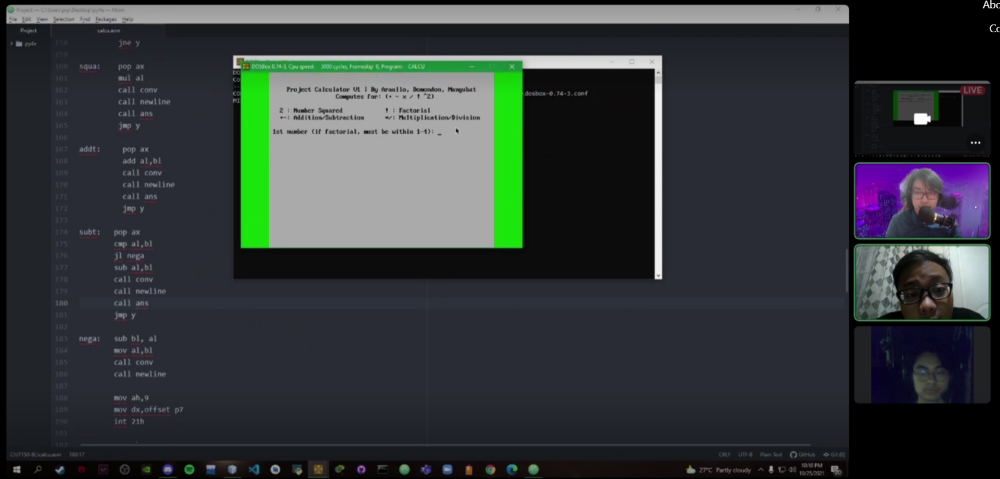

# PROJ - Custom Calculator
***
We were tasked to make a calculator. One of the requirements was to add custom functions to this calculator aside from the typical addition, subtraction, multiplication, and divison. So we decided to include finding the factorial and square value in this calculator.

[Click here to view the video demo](https://mymailmapuaedu-my.sharepoint.com/:v:/g/personal/eeaaraullo_mymail_mapua_edu_ph/ETfeM0YyY-FGtdgL4kFo4PkBNXlzF_TqPlslv_uU8pAK1A?e=ngaw0c&action=embedview)
 

